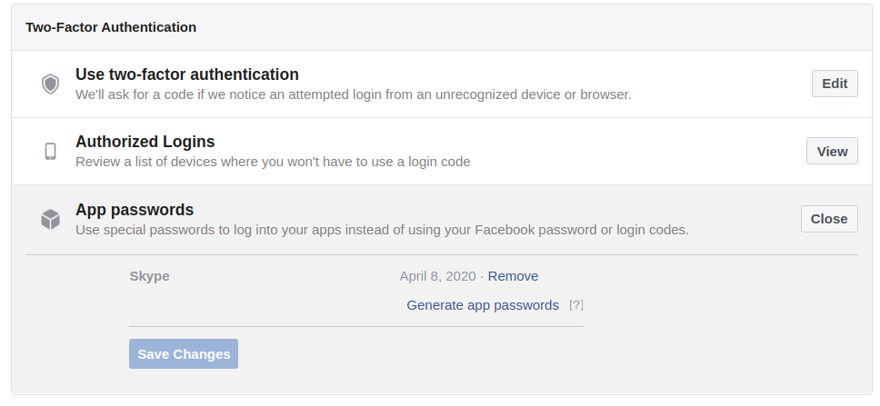

# Review Application Passwords

Facebook allows to create passwords dedicated for some applications. To check if there is any Application Password, visit the page [Settings > Security and Login](https://www.facebook.com/settings?tab=security&section=per_app_passwords&view) and check the `App passwords` section :

You should remove from this list any application password that you are not using.
