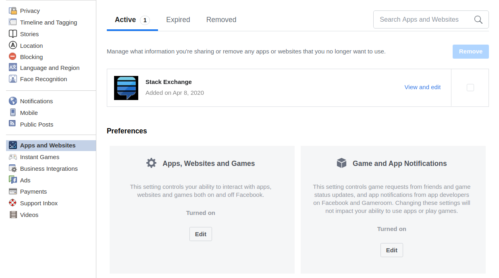
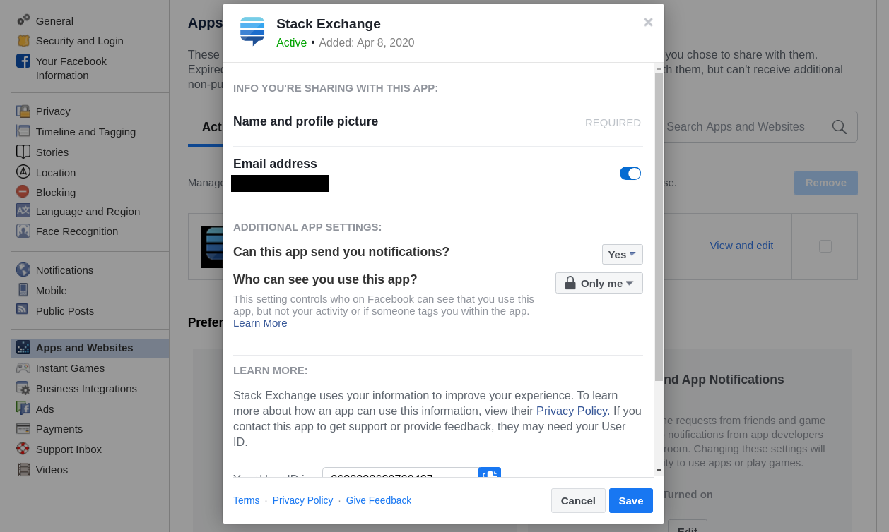

# Review Applications Connected to your Account

Facebook allows to connect your account to different types of external applications, wether because you want to login with your FB account or because you want to add  some features to Facebook. These apps are at the source of a lot of privacy and security issues, so you should take time to review this step carefully. To see the apps connected to your account, go to the page [Settings  > Apps and Websites](https://www.facebook.com/settings?tab=applications), you will see a list of applications connected to your account :

For each application, you can click on it to see the detail of their access rights to your account :

You should remove from that list any application you are not using and that is not important for you.
