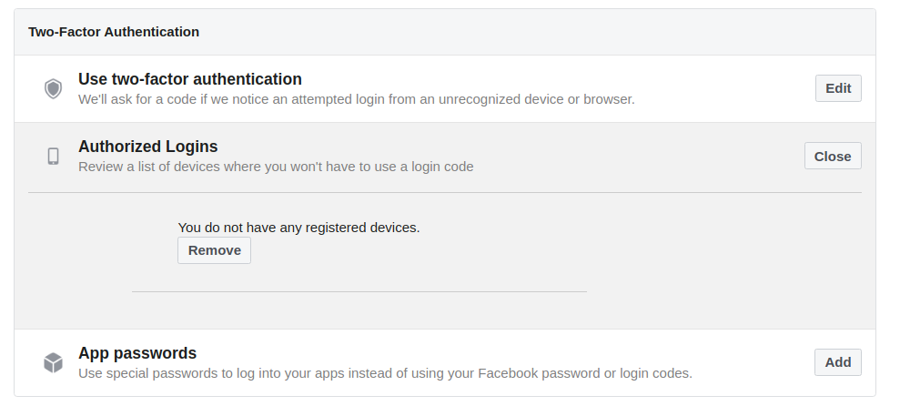

# Review Authorized Devices

Facebook allows some devices yo access your account without password. You can see the list of devices in the page [Settings > Security and Login](https://www.facebook.com/settings?tab=security&section=authorized_logins&view) at the section `Authorized Logins`.

You should remove from this list any device that you don't own and use.
