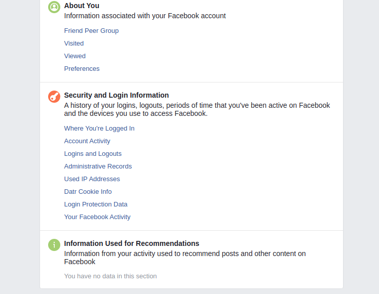

# Review Your Past Logins

As of the time of writing this guide, Facebook only allows you to see through the web interface the active connections to your account and not review past connections to see if there was any suspicious activity. It is still possible to check past logins by downloading all the Facebook data of your account and checking the past logins in this file.

To do that, go to the page [Settings > Your Facebook Information](https://www.facebook.com/settings?tab=your_facebook_information) and click on "Download Your Information".

In the list of types of information, you need to have at least "Security and Login Information" selected (keep HTML format unless you have a good reason not to).   Then click on "Create File" and wait a few minutes until the archive is available. Once the archive is available (Facebook will send you an email too), click on "Available Copies" and download the last archive.

You have then to unzip the archive, and double click on `index.html` that will be opened in your browser. From that page, you can now navigate in your Facebook data. Search for the "Security and Login Information" and you can have access here to different login information, the two pages you should check are "Where You're Logged In" and "Used IP Addresses".

Here is an example of the format of the "Where You're Logged In" page :

If you see any unusual connection in one of these two pages, check more precisely the "Account Activity" page to see when the connections happened.

