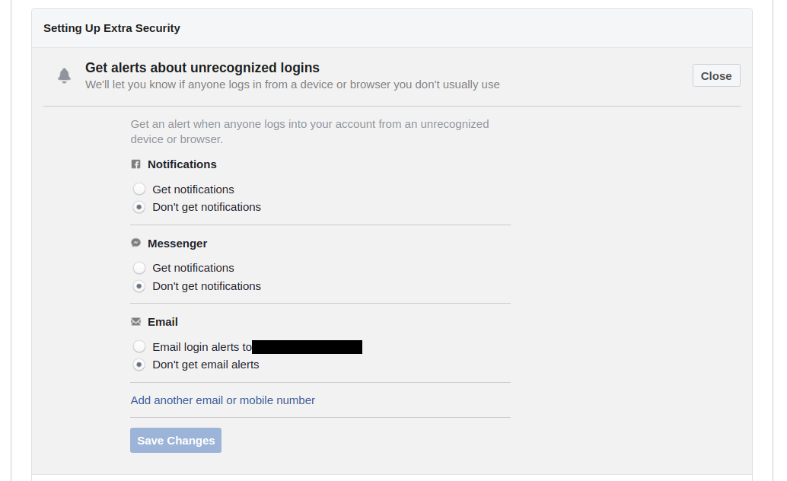

# Additional Checks

These few steps have made sure that no one else than yourself has access to your account, yet Facebook is a complex ecosystem that often involves more risk than just having other people access your account, as more data than we often think is available publicly. here are a few extra steps you should consider to increase your security and privacy.

## Enable Alerts when Someone Login from a new Place

Facebook as an interesting feature to send you alerts each time someone login to your account from a new location or device. You should consider enabling it. The alerts can be delivered on Facebook, on Facebook Messenger or by email.

To enable it, go to the page [Settings > Security and Login](https://www.facebook.com/settings?tab=security&section=login_alerts&view) and check the section "Get alerts about unrecognized logins". You can here enable this feature with the type of alert you want :

## Review Your Privacy Settings

By default, Facebook allows a large access to your publications. If you have any risk of someone stalking at your Facebook activity, you should consider the following actions :

* Review [who can see your posts](https://www.facebook.com/settings?tab=privacy). If you change the visibility of your posts, you may consider also limited the visibility of your past posts.
* [Limit the indexation of your profile by search engines](https://fb.me/SearchEngines)
* [Limit or disable the sharing of your location](https://fb.me/LocationPrivacy)

If you are at risk of harassment on Facebook, you should consider the following actions :

* [Review and approve posts tagging you](https://fb.me/TagReview)
* [Limit who can post on your timeline](https://www.facebook.com/help/1640261589632787/)

## Additional Resources

If you are looking for resources on how to be more secure and private on Facebook, you should have a look at the following resources :

* [A Guide to Staying Safe on Facebook](https://www.womensaid.ie/assets/files/pdf/a_guide_to_staying_safe_on_facebook.pdf) by Women's Aid
