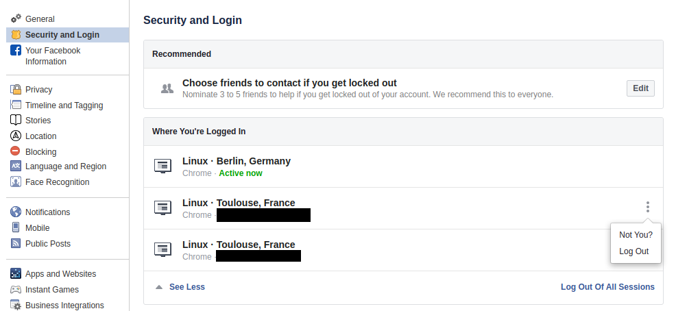

# Review Your Active Sessions

To review your active sessions, go to the page [Settings > Security and Login](https://www.facebook.com/settings?tab=security), and check the section `Where You're Logged In` :

For each session, you can hover over the city name and see the exact IP address.

We recommend to log out from any session your are not using right now. If you see any unknown connection here, take a screenshot or write down the IP address.

(You can find the relevant Facebook documentation in this feature [here](https://fb.me/ActiveSessions))
