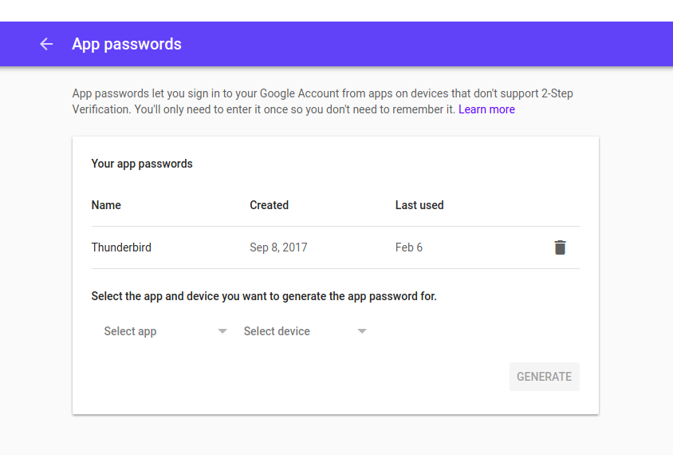

# Check Application Passwords

If you have Two Factor Authentication enabled (and you should), it is not possible anymore to use email applications like Thunderbird or Outlook because they do not support 2FA. To deal with this, Google has implemented application-specific passwords. It means that you can create a password just for this application. It is also a good way for anyone having a temporary access to a compromised Google account to keep having access to the emails once the password is changed. To check for these app passwords, go to this page and check for any app password : https://myaccount.google.com/apppasswords

There should not be any password here that you have not set yourself. If you see any application here that you do not use, just remove it.
