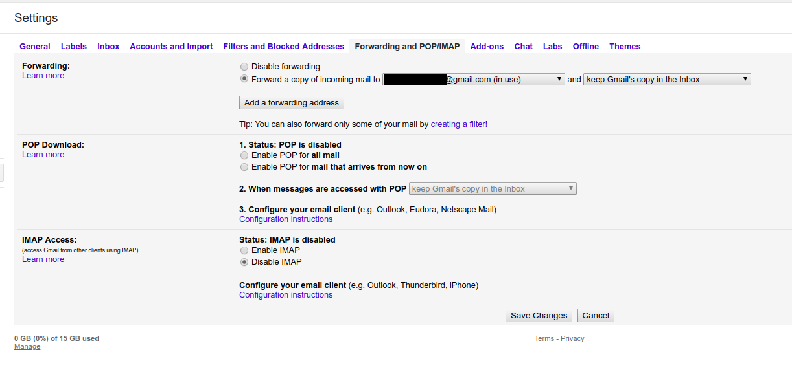

# Check Auto-Forwarding

Auto-forwarding is an easy way for an attacker to have access to any email after compromising an account. Thanksfully, Google is showing notifications both in the interface and by email when auto-forwarding is enabled, but it is still needed to check this parameter during a checkup. To see this parameter, you need to go in your Gmail inbox, click on the Settings icon on the top right, click "Settings" and go to "Forwarding and POP/IMAP", or directly to this page https://mail.google.com/mail/#settings/fwdandpop

Be careful that even if there is a malicious email address here but forwarding is disabled, this address can be used through filter still. Be sure to delete any email address you do not own or trust.

On the same page, you can check if POP and IMAP are enabled. It should not be needed if you are using a browser and android app to access Gmail.

