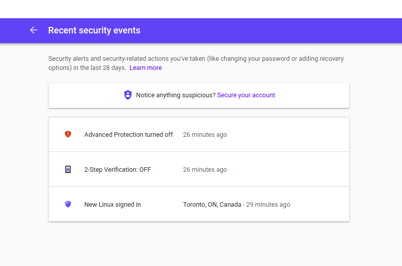

# Review Security Events

It is common for an attacker to disable security features on an account as soon as they have access to it. You can easily check any change on this page : https://myaccount.google.com/notifications

