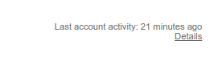

# Checking Last Activity

There are two ways to check for your recent activity in Google.

## List of Devices Recently Used

The first one is to check the list of devices recently used, it is incomplete but a good start. Go to this page : https://myaccount.google.com/device-activity

You can see here all the devices used recently :

If you click on any device, you can see the last activity and the software used. For other devices than the one you are using, you can disconnect them:

It is interesting but not showing detailed information of where the connection is coming from, only an attempt to geolocate the city.

## Checking Last Account Activity

The get more in depth information, you need to go on your Inbox and click on "Details" at the complete bottom right of the page :

This page gives detailed information on your recent activity, including the IP address and the browser User Agent (if you click on "Show Details"):

This information is only available for a short period (a couple of days or weeks), so if you see any sign of suspicious activity, please take a screenshot or write somewhere any interesting information (date and time, IP address, user agent) as it may not be available next time you will check this page.
