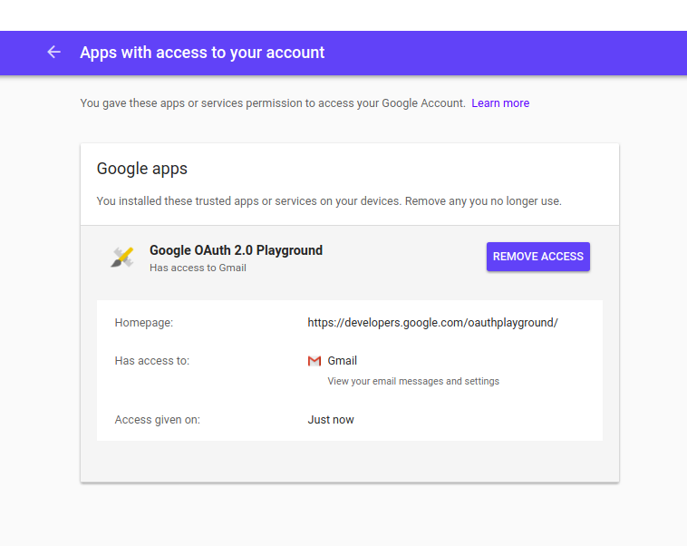

# Review OAuth Applications

OAuth is a protocol to allow external applications to access to Gmail account and information. These applications have to be created in Google OAuth platform and then they can ask different permissions to your Google account (including full access to your emails). It has been used regularly since 2015 in phishing campaign (see [this](http://blog.trendmicro.com/trendlabs-security-intelligence/pawn-storm-abuses-open-authentication-advanced-social-engineering-attacks/) or [this](https://citizenlab.ca/2018/01/spying-on-a-budget-inside-a-phishing-operation-with-targets-in-the-tibetan-community/)). To check OAuth permisions, you should visit this page : https://myaccount.google.com/permissions

