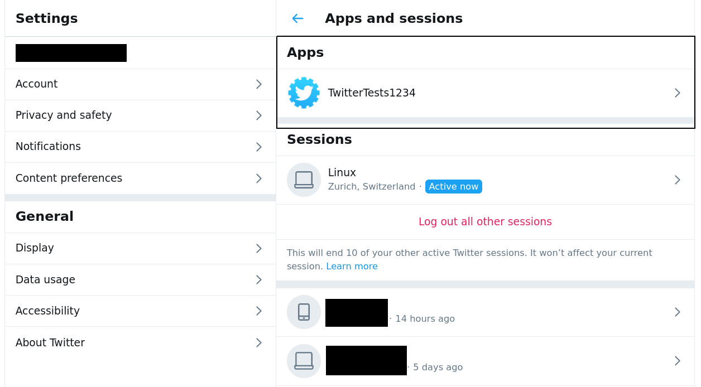
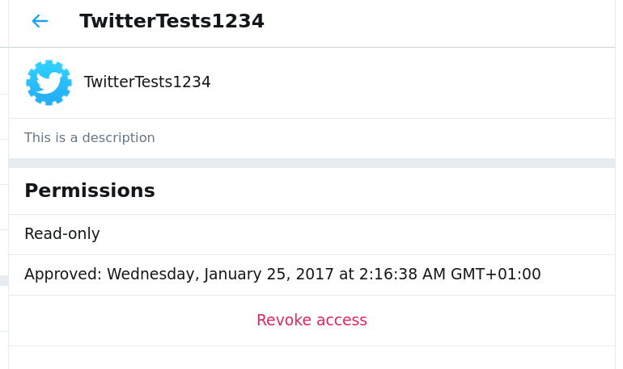

# Check Applications

Third-party applications can have access to your account, this is also used in phishing attacks to access accounts maliciously.

To check the applications authorized to access your account, to go [Settings and privacy > Account > Apps and Sessions](https://twitter.com/settings/applications) and check the list of applications :

You can click on an application to see its permission and when it was added :

If you see in this list any unknown application, you should definitely revoke access to it (by clicking on the "revoke access" button at the bottom of the page).
