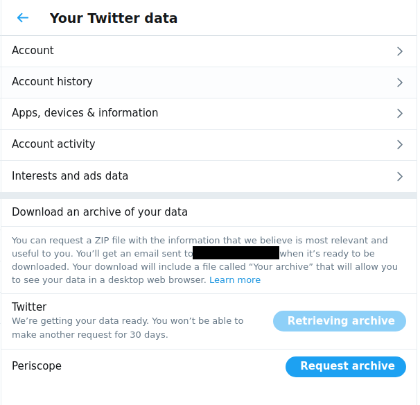
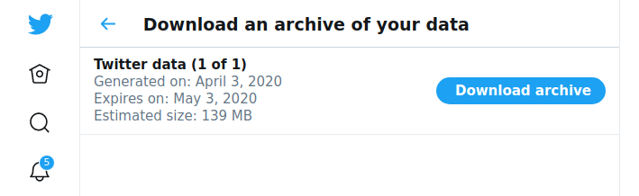
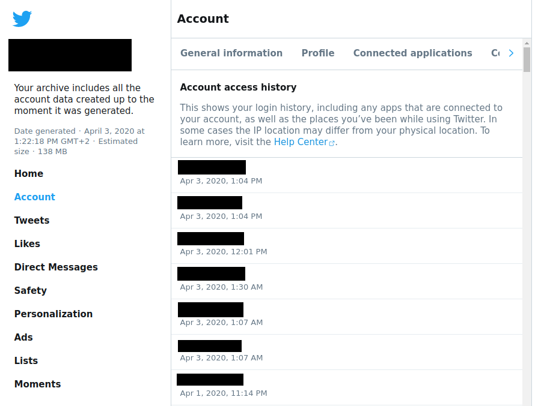

# Download all your Twitter data

To have a full view of your Twitter activity, it is possible to download all your twitter data form the page [Account > Your Twitter Data](https://twitter.com/settings/your_twitter_data):

You have to click on "Retrieve Your Data". Twitter will then send your an email with a link to download your data :

You will download a zip file, that you need to extract. From there, you have to double click on the file `Your archive.html` that will be opened in your browser, and you can browse your data offline. If you fo to `Account > Account Access History`, you can see the details of all your connections for the past two months :

The IP addresses have not any location information with them, you will have to geolocate them manually. If you need to see the raw data, they are stored in the file `data/ip-audit.js`.
