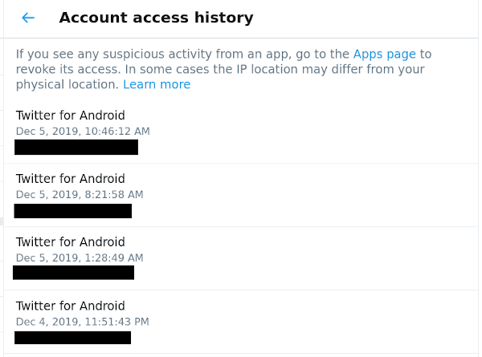

# Review Account History

You can see a detailed history of your the access to your account in the detailed data access that Twitter provides on the web interface. Visit the page [Settings andprivacy > Account > Your Twitter data > Account history > Account access history](https://twitter.com/settings/your_twitter_data/login_history)

This page contains information on all your connections for the past month.
