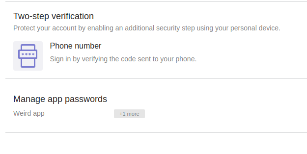
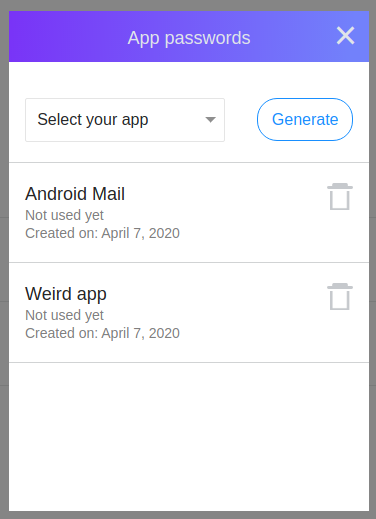

# Check Application Passwords

Yahoo allows you to create specific passwords for applications. You can check and remove application passwords from [Your Account Info > Account Security](https://login.yahoo.com/account/security) :

You can click on the App Password section to see the full list of apps.

We recommend to remove any application you are not using.
