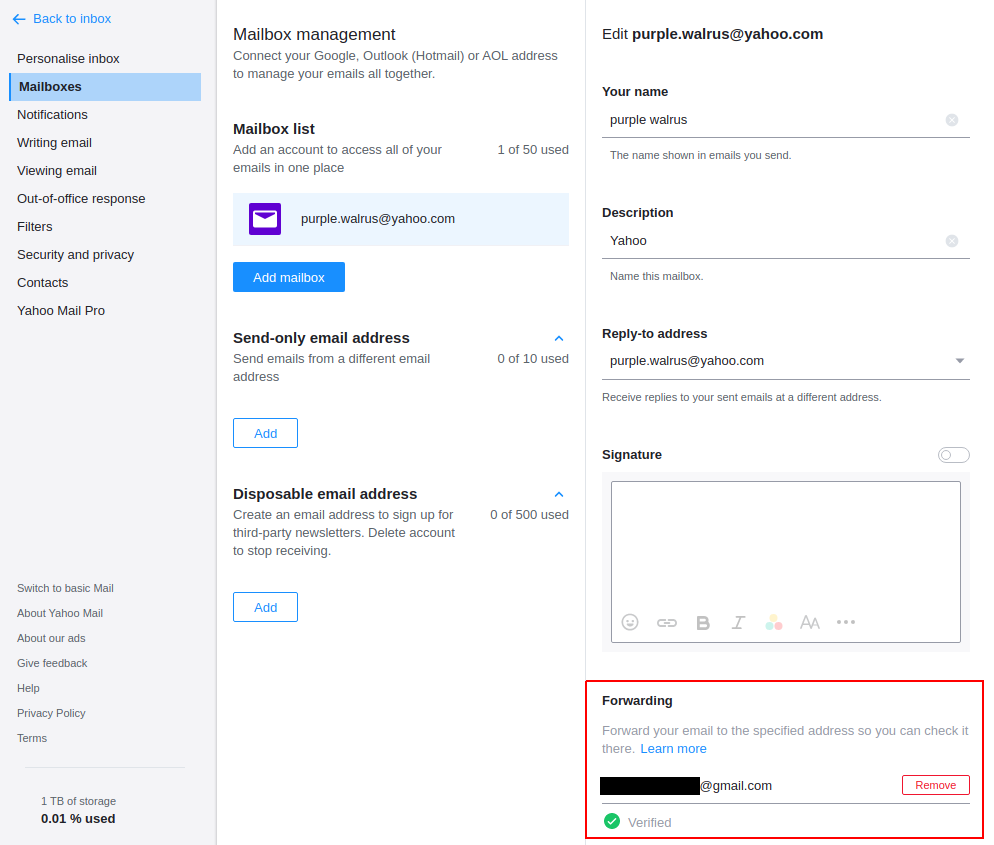

# Check Your Forwwarding Settings

As many email providers, Yahoo Mail allows you to forward all your emails to another mailbox. It is sometimes used by attackers to continue tracking a victim emails after they resetted their password.

To check your forwarding settings, go to your Inbox, click on [Settings > More Settings > Mailboxes](https://mail.yahoo.com/d/settings/1), and click on your mailbox name. On the bottom of the page, you will see the forwarding section with email addresses :

You should not have any email address listed there unless you configured it otherwose.
