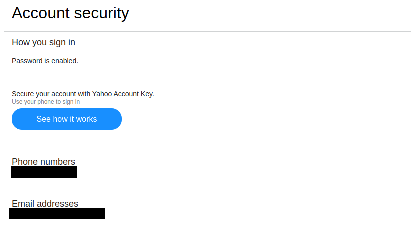

# Check Your Recovery Information

In case you would forget your password, Yahoo allows to have a phone number or email address as recovery information. You may want to configure them for that purpose, but more important, you need to make sure no email or phone number that you do not have access to is listed in recovery information. To see recovery information, visit the page [Account Info > Account Security](https://login.yahoo.com/account/security) :

Make sure there is no email address or phone number here that do not belong to you.
